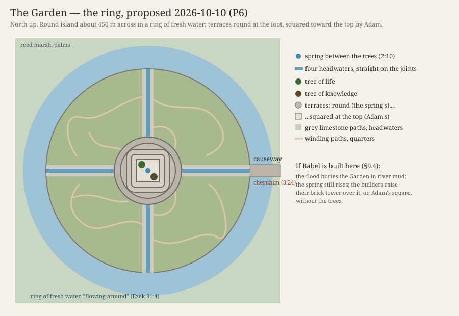

# The Garden — What It Looked Like

> Research for what was README item 6 (answered and taken off the list): the shape, the layout and the light of the Garden of Eden, and what I think of your picture of it. Companion to the [Garden dossier](./DOSSIER.md), whose §2 ("The look") this extends. The look it proposes was decided on 2026-10-09 (§6).

**Status:** v1.3, 2026-10-10 (late): fixes from the project audit. Ezekiel 31:4 is an echo of Eden, not a picture of it, so the water all round is Compatible, not Supported (§2, §5.2, §9.5); Eridu's first shrine is older than the provisional date for Adam, so Eridu as the gate needs a date decision (§3, §10.4); Ur is about 19 km away, not 12 (§9.3); and smaller corrections (the elephants and tigers, tufa and travertine, the Iranian words). v1.2, 2026-10-10 (evening): your notes on §9 are answered in §10. **Decided:** the ring, with Adam's work (straight headwaters, a squared top, smoothed stone); the light (sunny, cool, breezy, dry); the rivers crossing the ring; the limestone a stranger in the plain. §6 is updated to match. **Open:** gold, which tree is north, Eridu as the gate, and Babel. v1.1, 2026-10-10: your questions of 2026-10-10 (why the Garden is where it is, Babel, Ur and Uruk, and a ring instead of a square) are answered in §9, **as proposals: nothing in §6 changes until you say so.** v1.0, 2026-10-09: **the plan is decided** and folded into the [dossier's §2](./DOSSIER.md#2-the-look). v1.0 adds your last answers: the plan, the two kinds of path, the spring in the marsh, and your rule for the whole Garden (§6). v0.6 recorded your note that the paths are clear and smooth and the Garden well kept (§6, §7). v0.5 recorded your yes to the spring-built centre and answers whether it could be out in the delta (§5.7). v0.4 added where the water comes from. v0.1 was written from your note below; v0.2 added your two comments on it (the stones' size and the ground itself, §5.4; the mood and shadow, §6); v0.3 added your rule for the living things (§6). Decided: **everything in §6**, under one rule, yours: "find the line between natural and too rare to be natural; I think that's where the magic is" ([FOUNDATIONS](../../../../canon/FOUNDATIONS.md#4-decisions-so-far)). Everything else here is still a proposal.

Your note of 2026-10-09:

> I was thinking that the Garden should be square shaped with water surrounding all four sides, but this may be wrong. What I do need the scene to feel like is something natural, with blue-lighting peeking through the trees and bushes from the sun that pairs well with grey/dark grey stone (almost like a Greek feel to me). I want you to deeply research the Garden and what it possibly looked like, its layout, etc. and tell me what you think.

---

## 1. The short answer

**Your square with water on four sides isn't wrong. It's the oldest shape paradise has.** The text never gives the Garden a shape, but every later picture of it that the Bible and its neighbours drew is either square, or ringed with water, or both: Ezekiel's great cedar, the tree Eden's trees envied, with "its rivers flowing around the place of its planting" (Ezek 31:3–9); the holy of holies, a cube (1 Kgs 6:20); the New Jerusalem, "foursquare," with the river of life and the tree of life inside it (Rev 21:16; 22:1–2); and the Persian walled garden, the *pairidaeza*, whose name the Greek Bible borrowed for Eden and which gave us the word "paradise."

**And it fits with the stepped centre** you already proposed instead of replacing it. Put the two together and you get one design where every piece comes from a verse:

- A square island of stone and planting, raised a little above the marsh, with fresh water all round it. That's the enclosure the word *gan* implies, without a wall.
- At its centre, broad low terraces, square like the base of every temple-mountain on that plain, with the two trees on the open top "in the midst of the garden" (2:9; 3:3).
- A spring on the top that runs down the four faces in four channels to the four sides: the "one river divided into four heads" (2:10), in miniature, quartering the Garden the way the Persian paradise garden is quartered.
- **One dry way in, a causeway on the east.** When they're sent out, they cross it, and that's where the cherubim and the turning fire stand (3:24). The water makes the text's "way to the tree of life" a single path you can guard.

**The blue light is right, with one change to how it's made:** in nature the blue comes from the shade, not the sun. Morning mist off the water, cool shadow, and warm shafts of sun breaking through it gives you exactly the image you describe, and it gives the Garden a light of its own that the outside never has.

**The grey stone and the Greek feel work if we keep the feel and leave out the forms:** weathered grey limestone, dry-laid, worn and mossy, under plane trees and cypress (both named in Ezekiel's Eden), and no columns, no carving, no cut marble. Greek forms are three thousand years too late for the plain; the Greek *feeling* (old stone, raking light, a grove that is also a sanctuary) is what you're actually after, and it can be had honestly.

**Grade for the whole design: Compatible.** Supported on the river dividing (Gen 2:10), the trees at the centre (2:9), the mountain (Ezek 28:14), and the way east (3:24); Compatible on the water all round (Ezek 31:4 is an echo of Eden, not a description of it; §2). The square is P4 (the sanctuary, Revelation and the ancient gardens) staged as P5 (yours). The details follow.

---

## 2. What the texts say

Everything the Bible says about the Garden's form, gathered in one place. The texts are few, but they're more specific than most people remember.

### Genesis 2–3

| Feature | Text | What it gives the build |
|---|---|---|
| A garden *in* Eden, in the east | "The LORD God planted a garden in Eden, in the east" (2:8) | Eden is the larger region; the garden is a place within it. *Planted*, not built. |
| *Gan*, a garden | 2:8 and throughout | From the root *g-n-n*, "to enclose, to shield." A *gan* is a protected plot: "a garden locked... a spring sealed" (Song 4:12). The word implies an edge, though the text never says what the edge is. |
| Every tree, for sight and for food | "every tree that is pleasant to the sight and good for food" (2:9) | Beauty first, then food. **Your rule (2026-10-09):** the plants and animals are the region's own, or at least the wider region's (§6, "The plants and animals"). |
| Two trees at the centre | "the tree of life in the midst of the garden, and the tree of the knowledge of good and evil" (2:9); "the tree that is in the midst of the garden" (3:3) | A centre, which is the thing a square or a mountain naturally has. |
| One river, then four | "A river went out from Eden to water the garden, and from there it divided and became four heads" (2:10) | The water rises in Eden, waters the garden, and leaves it in four. "Heads" (*ra'shim*) can mean branches or mouths. How water could rise there naturally is §5.7. |
| Gold, bdellium, onyx | "the gold of that land is good; bdellium and onyx stone are there" (2:11–12) | The Garden's wealth is named as stone and resin: the same onyx (*shoham*) that's set on the high priest's shoulders (Exod 28:9). |
| Work and keep | "to work it and keep it" (2:15) | The same pair of verbs (*'avad*, *shamar*) used of the Levites' service in the tabernacle (Num 3:7–8; 8:26). |
| Fig trees | "they sewed fig leaves together" (3:7) | The one tree named besides the two. There is a fig in the Garden, near enough to reach in a moment of shame. |
| Trees to hide among | "hid themselves... among the trees of the garden" (3:8) | It's dense enough to hide in. Not a park. |
| The wind of the day | "walking in the garden in the wind of the day" (3:8) | The evening breeze: the Garden has a time of day, and a sound. |
| The way east, guarded | "at the east of the garden he placed the cherubim and a flaming sword that turned every way, to guard the way to the tree of life" (3:24) | An entrance on the east, and only one "way." Every later sanctuary of Israel faces east too (Exod 27:13; Ezek 43:1–4; 47:1). |

### Ezekiel 28 and 31: Eden remembered

Ezekiel is the only other writer who describes Eden at length, and he describes it twice, as a parable about kings.

- **A mountain** (28:13–16): "You were in Eden, the garden of God... you were on the holy mountain of God; in the midst of the stones of fire you walked." The Garden is on a height, and its top is paved with something that burns or shines.
- **Stones** (28:13): "every precious stone was your covering: sardius, topaz, and diamond, beryl, onyx, and jasper, sapphire, emerald, and carbuncle; and crafted in gold." Nine stones, all of them among the twelve on the high priest's breastpiece (Exod 28:17–20); the Greek translation lists all twelve. The *sappir* here is almost certainly lapis lazuli, the blue stone. *High confidence on the list and the overlap; medium on the exact identities of the stones.*
- **Water all around** (31:4): "The waters nourished it; the deep made it grow tall, making its rivers flow **around** the place of its planting, sending forth its streams to all the trees of the field." The Hebrew *sevivot* means "all around." **But this tree isn't in Eden.** It's Assyria, "a cedar in Lebanon" (31:3), the tree that "all the trees of Eden envied" (31:9), whose fall comforts them in Sheol (31:16, 18). So the rivers round its planting aren't Eden's. It's an echo: Ezekiel pictures the greatest tree he can, in Eden's company, with water all round it. Fair support for the look, not proof, and Ezekiel's own Eden mountain (28:13–16) has no water. *Corrected 2026-10-10 after the project audit; I had called this the clearest support for your picture.*
- **Named trees** (31:8–9): "The cedars in the garden of God could not rival it, nor the fir trees equal its boughs; neither were the plane trees like its branches; no tree in the garden of God was its equal in beauty... all the trees of Eden envied it." Cedar, a fir or cypress (*berosh*), and the plane tree (*'armon*). The plane is the shade tree of Greece and of every Near Eastern river; this is where your Greek feel can come from honestly. *The berosh is disputed: cypress, juniper or fir.*

### The sanctuary: the Garden copied

The tabernacle and the temple were built to remember the Garden, and the scholars (§4) have read them backward to see what the Garden was taken to look like.

- **The holy of holies is a perfect cube** (1 Kgs 6:20), lined with gold, with two cherubim over the ark.
- **The temple walls are a garden:** "carved engraved figures of cherubim and palm trees and open flowers" (1 Kgs 6:29), with gourds and pomegranates (1 Kgs 6:18; 7:18–20). The lampstand is a stylized almond tree (Exod 25:31–36).
- **Cherubim guard the way in** on the veil (Exod 26:31), as at the Garden's east (Gen 3:24).
- **God walks** among his people in the sanctuary with the same verb (*mithallek*) as in the Garden (Lev 26:12; 2 Sam 7:6–7; Gen 3:8).

### Ezekiel 47 and Revelation 21–22: Eden restored

The Bible ends where it began, and the end is drawn as the Garden rebuilt.

- **Water from the sanctuary, flowing east** (Ezek 47:1–12): it rises from under the temple's threshold, grows from ankle-deep to a river, and "on both banks... will grow all kinds of trees for food... their fruit will be for food, and their leaves for healing."
- **The city is square** (Rev 21:16): "The city lies foursquare, its length the same as its width... its length and width and height are equal." A cube, like the holy of holies.
- **The river and the tree inside it** (Rev 22:1–2): "the river of the water of life, bright as crystal, flowing from the throne of God... through the middle of the street of the city; also, on either side of the river, the tree of life."
- **Psalm 46:4** has the same picture: "There is a river whose streams make glad the city of God."

**What the texts add up to:** a centre with two trees; water that rises there and leaves in four; a height; precious stone; rivers flowing round the planting (in Ezekiel's echo, 31:4); dense trees, among them cedar, cypress, plane and fig; one way in, from the east. The square is Revelation's, not Genesis's, but it's the Bible's own last word on what the Garden becomes.

---

## 3. What the ancient world says

None of this proves what the Garden looked like. It shows what gardens, and paradise, looked like to the people who lived nearest it in time and place.

**Eridu sat on an island.** The city you set the Garden beside ([008, round 2](../../../../discussions/008-adam-eve-and-the-garden.md#round-2--2026-10-08)) was founded on a virgin sand dune, a low natural rise in a depression that floods into a lake every winter and spring, with the marshes on its east and the Gulf near at hand. Its temple was the house of Enki, god of fresh water, called the "House of the Aquifer," the Abzu: the fresh water under the earth, rising. The first shrine was a small mudbrick square; each rebuilding raised it on a higher platform, seventeen or eighteen times, and that sequence is where the ziggurat comes from. So the real place nearest your Garden was a raised square sanctuary on a rise ringed by water, built over a spring. That's very nearly your picture, drawn in mud. *One catch, on the dates:* Eridu's first shrine is about 5400 BC, older than the provisional date for Adam (about 5000–4000 BC), so on the current dates its builders were the Garden's neighbours, not people remembering it. That's for you to settle (§10.4; README item 20).

**The Mesopotamian temple-mountain is square.** Every ziggurat has a square or rectangular base with its corners or faces set to the four directions. The Sumerians called their temple-mountains "house of the mountain" and "bond of heaven and earth."

**The Assyrian kings built hills with gardens on them.** A relief from Ashurbanipal's palace at Nineveh (7th century BC, now in the British Museum) shows a wooded hill, watered by channels fed from an aqueduct, with a small shrine on the top. Stephanie Dalley argues that this, Sennacherib's garden at Nineveh, was the real "Hanging Gardens." A planted mountain with water running down it was the Near East's idea of a royal paradise. *Medium confidence on Dalley's identification; the relief itself is certain.*

**The word "paradise" is Persian, and it means an enclosed, quartered garden.** Old Iranian: Avestan *pairi-daēza*, Old Persian *paridaida*, "walled around." Xenophon brought it into Greek as *paradeisos*, and the Greek translators of Genesis (the Septuagint, 3rd century BC) used it for the garden in Eden; it's the word in Luke 23:43 and Revelation 2:7. The oldest surviving one, Cyrus's garden at Pasargadae (6th century BC), is laid out on axes of stone water-channels; the later Persian *chahar bagh* ("four gardens") is a rectangle quartered by four channels meeting at a central pool, and it was read, in the Islamic period, as the four rivers of paradise. Your square with water is, almost exactly, the thing the word "paradise" first named.

**Gilgamesh walks through a garden of stone** (Tablet IX). Beyond the mountains at the end of the world he comes to trees of gemstones: carnelian bearing fruit, lapis lazuli bearing leaves. It's the same image as Ezekiel's "every precious stone," centuries before him, and its leaves are blue. *Medium confidence on the line-by-line wording, which differs between translations.*

**Dilmun, the Sumerian paradise, is an island** down the Gulf (Bahrain), "where the lion kills not," pure, watered by Enki's fresh water rising from below. The Sumerian paradise is a place ringed by the sea, where fresh water comes up through the salt.

**The Greeks put paradise on water too.** The Garden of the Hesperides, at the western edge of the world beside the river Ocean, has a tree with golden fruit and a serpent coiled round it (Ladon). The Isles of the Blessed and Elysium lie across the water. I suspect this is part of why your picture feels Greek to you: the Greeks remembered paradise as a garden across water, with a tree and a serpent. That's a resonance to be aware of, not a source; the audience may feel it too.

**And the counterfeit is square and moated.** Herodotus describes Babylon (1.178–180): "in shape a square... Around it runs first a moat deep and wide and full of water... It is cut in half by a river," the Euphrates. Whatever his accuracy, that's the classical picture of Babylon: Eden's plan, built in brick by men, with the river through it. Revelation sets Babylon (Rev 17–18) against the New Jerusalem (21–22) on purpose. See §5.6.

---

## 4. What the scholars say

**The Garden is the first sanctuary.** This is close to a consensus in Old Testament scholarship since Gordon Wenham's paper "Sanctuary Symbolism in the Garden of Eden Story" (1986), carried on by G. K. Beale (*The Temple and the Church's Mission*, 2004), John Walton (*Genesis*, NIV Application Commentary, 2001; *The Lost World of Genesis One*, 2009) and others. The evidence is the list in §2: the east entrance, the cherubim, the verbs for the Levites' work, God walking, the gold and onyx, the menorah as a tree, the temple's carved garden. Discussion 009 already rests on it ([009, "What the texts say"](../../../../discussions/009-god-in-the-garden.md)).

**Three zones.** Walton and Beale read the geography as concentric: Eden itself, the source, where God's presence is (like the holy of holies); the garden beside it, where the man serves (like the holy place); and the world outside (like the courtyard, and then the nations). The water flows outward through all three. That's a layout, and it's a nesting of squares in the sanctuary that copies it.

**Eden is on a height.** Besides Ezekiel 28, the river flowing out of Eden to water the garden and leave it implies the source is higher than what it waters. Many readers (Wenham among them) take the "mountain of God" as part of the Garden's picture, joined to Sinai and Zion later.

**The case against all of this.** Some scholars (James Barr among the older ones) caution that Genesis 2–3 is spare on purpose and that reading the temple into it imports a later theology into an older story. Others read the Garden as a royal park, a king's garden in the Near Eastern style, with the man as its gardener-king, not its priest. Both are worth keeping in mind: the first argues for restraint in the build, the second agrees with the formal, quartered shape for a different reason.

---

## 5. Your picture, tested

### 5.1 Square

**For it.** The Bible's own final Garden is square (Rev 21:16) and its holiest room is a cube (1 Kgs 6:20). Ezekiel's restored sanctuary and holy portion are square too (Ezek 45:2; 48:20). The temple-mountains of the Garden's plain are square-based. The paradise garden is quartered. A square has a centre and four directions, and the text has a centre (2:9) and a river that goes four ways (2:10).

**Against it.** Genesis doesn't say. A perfect square looks made by someone, and "the LORD God planted" (2:8). The more geometric it is, the more it reads as a palace garden, and the more the Garden looks like Babylon.

**What I'd do.** Square in its bones, soft at its edges: the island and the terraces are laid out on the four directions, and the four channels quarter it, but the shoreline is stone and roots and reeds, uneven, overgrown. You feel the square from the top of the terraces, looking down, and nowhere else. **Grade: Compatible** (P4 from Revelation and the sanctuary; P5 the staging).

### 5.2 Water on all four sides

**For it.** Ezekiel's great cedar, the tree Eden's trees envied, has rivers flowing all around the place of its planting (31:3–9): an echo of Eden rather than a description of it, but the picture is there. It makes *gan*, the enclosed garden, an enclosure without a wall, which keeps the dossier's rule (no wall in the text) and fixes its weakness (a *gan* needs an edge). Eridu itself was a rise ringed by water. It turns 3:24 into something you can see: water on every side and one way across it, from the east. And it fits the decided geography: the lower plain in 5000 BC was a land of marsh and channels at the sea's edge, so an island is the most natural thing in it.

**Against it.** Genesis 2:10 has water flowing *out* of the Garden in four, not round it. And Revelation's new world has "no more sea" (Rev 21:1), so water as the Garden's barrier may sit oddly with the sea as chaos.

**What I'd do.** Let the surrounding water be fresh and moving, the four channels running down from the spring and out into it, so it's the river leaving the Garden, not a moat holding it in. Beyond it is the marsh, and beyond the marsh, at the edge of sight, the salt sea. Fresh water inside and around, salt water far off: the line between them is exactly the line the Sumerians drew at Eridu (Enki's fresh Abzu against the salt sea). The fresh water is the Garden's; the sea is the world's. **Grade: Compatible** (Ezekiel 31:4 is an echo of Eden, not a description of it; corrected 2026-10-10).

### 5.3 Blue light through the trees

**For it.** It's beautiful, and it gives the Garden a light the outside doesn't have. Blue has a home in the texts: the pavement "like sapphire, like the very heaven for clearness" under God's feet on the mountain (Exod 24:10), the throne "like sapphire" (Ezek 1:26), Eden's *sappir* (Ezek 28:13), and Gilgamesh's lapis leaves.

**A correction on how to get it.** Direct sunlight through leaves is warm, and the light under a canopy is green. Blue comes from the sky: shadows lit by open sky are blue, and fine mist scatters blue light. So the look you describe is made like this: **cool blue shade, mist, and warm shafts of sun cutting through it.** The mist is in the text: the KJV's "there went up a mist from the earth, and watered the whole face of the ground" (2:6), the *'ed*, which 008 reads as the river's rising water. A morning mist off the water around the Garden, lit through the trees, is the 'ed made visible.

**What I'd do.** The Garden's light is cool, misty, with sunlight breaking in; the evening of 3:8 adds the wind through it. Outside, the light is flat, white and hot (the dossier's first shot after 3:24: "no color at all: mud, dust, thorns, heat"). The blue is in the light, never painted on the stone, so the color rule ("color only in what lives") holds. **Grade: Compatible.** P5.

### 5.4 Grey and dark grey stone

**For it.** The dossier already argues that the Garden's stone is the sign it isn't the plain's own work (the plain has no stone: "they had brick for stone," Gen 11:3). Grey stone under blue light is the right pair: the stone takes the light's color. Ezekiel's "stones of fire" on the mountain can be the summit's pavement catching the sun.

**Against it.** Dark grey can read as heavy or funereal. The text's Garden is about delight (*'eden* in Hebrew sounds like "delight").

**What I'd do.** A grey limestone, weathered, dry-laid (no mortar), worn smooth where feet go, green with moss where water runs. Darker grey at the waterline and in the channels, where it's wet; lighter at the summit, where it's dry and in the sun. Never cut square, never carved: placed. **Grade: Compatible.** P5.

#### Your follow-up (2026-10-09): huge stones, and the ground itself

> The harder part is going to be the size of the stones. Im imagining very large stones for paths (like 10-15 ft across, with cut divots length-wise every so often). Would it have been possible that the ground itself was grey limestone? Otherwise, we're going to have to discuss talented masonry (that is, smooth and precise, not detailed).

**Yes, the ground can be the limestone, and it's the better answer.** Bare limestone bedrock naturally weathers into exactly what you describe. Geologists call it a *limestone pavement*: broad flat slabs (*clints*), often several metres across, split by straight fissures (*grikes*) where water has widened the rock's joints. The fissures run in parallel sets, so they look like grooves cut lengthwise "every so often," and ferns, mosses and small flowers grow in them. The Burren in Ireland and Malham in Yorkshire are the famous ones (search "limestone pavement Burren" for the look). Shallow dish-shaped basins also dissolve into the surface and hold rainwater. Slabs 10–15 ft (3–4.5 m) across are well within what these pavements produce.

This solves three things at once:

1. **Nobody has to have built it.** "The LORD God planted" (2:8). A pavement of living rock has no masons, and the paths are just where the rock lies bare between the beds.
2. **The texts prefer uncut stone where God is met.** "If you make me an altar of stone, you shall not build it of hewn stones, for if you wield your tool on it you profane it" (Exod 20:25; also Deut 27:5–6). Solomon's temple was built so that "neither hammer nor axe nor any tool of iron was heard in the house" (1 Kgs 6:7). Precise masonry would pull against this. Natural rock agrees with it.
3. **The color rule gets a home in the stone.** The grey slabs are lifeless, and the color grows in the cracks between them.

**The terraces work the same way.** Limestone lies in beds, and where it erodes it often breaks into natural steps, one bed on another. The stepped centre can be a knoll of bedded rock that weathered into five broad ledges (superseded by §5.7: the spring built them). It's natural, but more regular than nature usually is. That slight excess of order, rock that looks almost too well arranged, is the sign of the second register (God through the world), and the audience doesn't need it explained.

**The catch is the geology of the place you chose.** The lower plain is river silt, many metres deep, with no rock at the surface. That's why the plain built in mud brick and Genesis says "they had brick for stone" (11:3). There is stone at the plain's western edge: Eridu sits beside a low sandstone ridge, and beyond it the desert plateau west of the Euphrates is limestone and sandstone, which is where the plain's later temples got what little stone they used. *Medium confidence on the exact formations; high that the alluvium has no surface rock.* There are two honest ways to handle it:

- **A. The Garden is a stranger in the plain** (my recommendation). A rise of limestone standing out of the marsh, where none should be, near where Eridu would stand. The dossier already treats the stone as "the sign that it isn't the plain's own work," and its trees come from the wider region, the hills and the Levant, not the delta. When the Garden is gone, the plain has only mud, and that is the point of Babel's brick.
- **B. The Garden is at the plain's edge,** on the limestone where the desert plateau meets the marsh, with the river's channels cut around it. This is geologically ordinary, and it puts the frontier (008's "wild, not hostile") right at the Garden's edge. It loses some of the strangeness.

**If you still want masonry:** it isn't impossible for the period. At Göbekli Tepe in Turkey, about 9500 BC, people quarried and shaped limestone pillars over five metres tall. But smooth, precise slabs 15 ft across would say "someone built this," and the question becomes who. I'd keep precision out of it and let the rock's size and flatness carry the awe.

**Grade:** natural pavement, **Compatible**, close to Supported by Exod 20:25. A limestone island in the delta (A) is P5 and deliberately unnatural. Precise masonry would be **Tension** with "planted" and with Exod 20:25.

### 5.5 "Almost like a Greek feel"

**For it.** I think what you're after is a mood: old stone in a grove, raking light, a place that is a sanctuary without being a building. That is honest to the text, which makes the Garden a sanctuary and gives it plane trees and cypress (Ezek 31:8).

**Against it.** Greek forms (columns, capitals, pediments, marble, statues) belong to the first millennium BC and to Greece. In the plain in 5000 BC they would be wrong twice over, and they would turn the Garden into the Hesperides.

**What I'd do.** Keep the feel; leave out the forms. Get it from the trees and the stone: plane trees with their pale bark over the water, cypress, cedar, olive, fig, pomegranate, with the plain's own date palm and tamarisk only at the shore. Grey limestone in terraces like the old dry-stone terraces of Greek hillsides. **Grade: Compatible** for the feel; **Contradiction**, of the setting rather than the text, for any Greek architecture.

### 5.6 The shape's double

Herodotus's Babylon is a square with a moat and a river through it. If the Garden is a square island with four channels, then Babel (Hour 7) and Babylon later (the Exile, and Revelation) are humanity's rebuilding of it: brick for stone, a wall for the water, a tower for the trees. The dossier already makes this argument for the stepped centre ([§2, point 3](./DOSSIER.md#2-the-look)); the square and the water make it stronger. It's an opportunity, and a risk: the Garden's design has to be clearly natural and alive, so the rhyme with Babylon reads as Babylon copying Eden and not the other way round.

### 5.7 Where the water comes from

Your question (2026-10-09): "How would the river have sprung up from the middle... Was there possibly some natural way water came out of the ground here?"

**Yes. That country is one of the places on earth where fresh water really does come up out of the ground, and its people built their religion on it.**

**What the texts assume.** The Bible's water comes from below as well as above: "a mist (*'ed*) was going up from the land and watering the whole face of the ground" (Gen 2:6); "the deep (*tehom*) made it grow tall" (Ezek 31:4); "the fountains of the great deep burst open" (Gen 7:11); in Ezekiel's temple, water comes out "from below the threshold" (Ezek 47:1); the promised land has "springs, flowing out in the valleys and hills" (Deut 8:7). The people of Eridu believed the same thing about that exact spot. Enki's temple there was the *Abzu*, the fresh water under the earth, rising. A spring at the Garden's centre is what both the Bible and the plain's own people would expect.

**What the geology says.** The plain's western edge sits on a great limestone aquifer, the Dammam: layers of fractured limestone running under Arabia and the Gulf. Rain that fell on Arabia's higher ground soaks into the limestone and flows north-east underground for hundreds of kilometres. Because it enters high and is sealed in under other rock, it's under pressure, and wherever a fault or fissure gives it a way up, it rises on its own and can come out above the surrounding ground. That's an *artesian spring*. Real ones in the region:

- **Bahrain, ancient Dilmun,** the Sumerian paradise "where the lion kills not": famous for freshwater springs fed by this aquifer from Saudi Arabia, through "highly fractured limestones," until 20th-century pumping stopped them. Divers' accounts also tell of fresh water welling up from the seabed (*medium confidence on those undersea springs*). The Sumerians put paradise exactly where fresh water came up through the salt.
- **Sawa Lake,** about 25 km southwest of Samawah, a little over 100 km up the Euphrates from Eridu: a lake in the desert with no river in or out, fed by groundwater from the higher desert to the west.
- **The springs along the Euphrates' desert edge,** such as Ain al-Tamr west of Karbala (*medium confidence on the details*).
- **And around 5000 BC the region was wetter** than now (the mid-Holocene humid phase), so the aquifers were fuller and the springs stronger. *Medium-high confidence.*

**How a spring makes its own hill, in steps.** Spring water that has passed through limestone carries dissolved lime. Where it comes out and runs over the ground, it lays the lime down again as new stone (travertine, a kind of limestone), and over centuries a spring can build a mound under itself and rise on it. Where the water spills over edges, it builds **terraces, step after step, with the water running down each one.** Pamukkale in Turkey and Badab-e Surt in northern Iran are the famous examples: whole hillsides of stone steps, built by springs.

**What I'd do.** Make the stepped centre a spring mound. The terraces are old travertine, weathered grey, mossy and overgrown (your grey limestone), built over ages by the spring that still rises from a fissure on the top, between the two trees. Where the water runs now, the fresh stone is pale and glistening, thin bright lines down the grey steps; that is Ezekiel's "stones of fire" catching the sun. The four channels are the spring's four overflows, and the water round the island is where they collect. In the cool of the morning, a mist can lift off the moving water (2:6's *'ed*). This answers three questions at once: **where the river comes from, why there are steps, and who built them. The water built them. Nobody cut anything, and "the LORD God planted" stands.**

**Decided 2026-10-09:** "Yes lets do this. That sounds really nice."

**The catches.** No spring mound like this is known on the delta itself. There the limestone lies deep under river mud, and the springs come up at the desert's edge. That is the choice between A and B in §5.4, decided below: out in the marsh. At the desert's edge (B) it's ordinary geology; out in the marsh (A) it's the sign that this place isn't like the rest of the plain. Second, the big travertine terraces at Pamukkale come from warm, mineral-rich water, and I can't show that the Dammam's water built anything like them. The mechanism is real, but the scale here is our choice. A word on names: strictly, warm springs build travertine and cool ones build tufa, a softer, more porous stone of the same kind. A cool aquifer spring like these would build tufa. In these docs "travertine" is the look word for the Garden's spring stone, old and weathered grey; fresh, it's tufa, soft enough to shape by hand (§9.5). **Grade: Compatible,** with the region's springs at P4 (real) and the spring-built mound at P5.

**Could it be out in the delta? Yes: rare, not impossible.** (Your question, 2026-10-09: "Its not impossible though, right?") Under the delta, the same water-bearing limestone is still there, only buried under the rivers' mud. The water under pressure needs a crack to come up through, and cracks exist: the ground under southern Iraq is folded and faulted (the buried domes of the oil fields near Basra are such folds), and Bahrain's springs were said to rise even through the seabed. A spring that finds a fault keeps flowing, and its lime builds a mound until it stands above the marsh. Nothing like it is known there today, but the mud has been piling up on that plain for seven thousand years and could bury one. At the desert's edge it would be ordinary; in the marsh it would be rare. Rare is exactly what the Garden is. **Decided 2026-10-09: out in the marsh** ("I like your pick"). *Medium confidence on the faults; high that the limestone runs under the delta.*

---

## 6. What I'd build

**Decided 2026-10-09** ("the plan looks good"), with your changes; **the ring and Adam's work replaced the square on 2026-10-10** (§9.5, §10).  *(The first, square plan is kept as [layout-plan.svg](./layout-plan.svg), superseded.)*

**The rule for the whole Garden (yours):** "Try to find the line between natural and too rare to be natural; I think that's where the magic is here." Everything below is meant to sit on that line: each thing has a natural cause you could find somewhere on earth, and the Garden has all of them at once, more perfectly than anywhere does. That's how the second register (God through the world, [009](../../../../discussions/009-god-in-the-garden.md#decision)) reads in the Garden's own geography: nothing impossible, just too well arranged to be chance.

### The plan

1. **The island.** Round, about 450 m across (decided 2026-10-10: "a ring works better"), raised a metre or two above the water, a stranger in the plain ("unordinary but not impossible"). Its edges are stone and roots. Walking from the shore to the centre takes about three minutes; Adam's first silent walk (movement 1) can wander well beyond that.
2. **The water.** A ring of fresh, slow, clear water, 30–60 m wide, all the way round: the spring's own pool, held a little above the marsh by a low natural rim of spring stone (§10.6). Beyond it the reed marsh, and beyond that the plain and, on the far south-east horizon, the sea. Reeds and date palms on the outer bank: the plain's own, seen from inside.
3. **The four headwaters and their paths.** The spring's four channels run out from the terraces to the four directions: the "four heads" of 2:10. They're straight to the ring (on the limestone's joints, and straightened further by Adam), cross it as current seams, and leave through the rim as natural rivers (§10.6). They're somewhat straight, and the paths along both banks are **the beautiful grey limestone**: the broad pavement slabs of §5.4, smooth, clean and wide. Why straight, naturally: limestone cracks along straight parallel joints, and water running over it follows them, so a spring's channels across bare limestone really do run in near-straight lines, with the slabs beside them split along the same lines. Straight enough to feel laid out, not so straight it couldn't have happened. That's your line.
4. **The four quarters and their winding paths.** Between the headwaters, four planted quarters of the circle, each different (one of orchard, one of tall trees, one of flowering plants and open ground, one dense and shaded). **Clear paths wind all through them**, and these needn't be limestone: packed earth, fine pale gravel, sand, stepping stones across the wet places, the soft ground worn smooth by feet and hooves. They curve with the land and the trees, the way animal trails do. They're clear and tended (your note, 2026-10-09), the planting kept up to their edges. The animals use both kinds of path.
5. **The terraces.** At the centre, five broad, low steps of grey stone, built by the spring itself (§5.7): round at the foot as the spring laid them, and squared toward the top by Adam's work (decided 2026-10-10, §9.5), about 130 m across at the foot and a 40 m square at the top, each about two and a half metres high, about 12 m in all. Worn, overgrown at the edges, smoothed where he worked them. A ramp or stair in the middle of each face, beside the channel.
6. **The top.** Open. A pavement of lighter stone that catches the sun (Ezekiel's "stones of fire"). The spring rises in the middle and splits four ways to the four faces (§5.7: an artesian spring that built the terraces itself). The two trees stand on either side of it, north and south (your proposal, 2026-10-10; which is which is open, §10.3), looking different but neither strange (dossier §2). That is Revelation 22:2 too: the tree of life "on either side of the river." From here you can see the whole Garden and the water round it.
7. **The way east.** One causeway across the ring on the east side, beside the eastern river where it leaves, the eastern headwater's limestone path carried on across the water to the plain. Coming in, you walk straight up between the two trees. It's the only dry way in or out. It's how they leave, a descent from the top and then the crossing, and the cherubim and the turning fire stand on it (3:24).

### The light and the palette

**Decided 2026-10-10:** "sunny yet cool and breezy, not hot and humid"; the shade makes the blue. Dry, clear air, crisp shadows, a breeze off the water, the plain's spring season (§10.1).

- **Morning:** a brief mist off the water and the channels that burns off in the first hour, cool blue shade, warm shafts through the trees. The first shot of the Garden.
- **Day:** the blue thins out but stays in the shadows. Grey stone, deep green, and color only in what lives (the dossier's rule): flowers, fruit, birds, fish in the channels, the animals.
- **Evening (3:8):** the wind of the day moving the trees; the light goes long and gold across the terraces; the shadows go deep blue. The sound in the wind is heard in that light.
- **Outside:** the plain's summer: flat, white, hot, hazy, without shade.

**Shadow is the main tool** (your note, 2026-10-09: "a natural, peaceful, and beautiful mood... correct use of shadows for these scenes will be what makes them"). Rules for the build:

- **Most of the frame is in shade.** The sun lands in a few patches and shafts, and the eye goes to them. The Garden is lit the way a forest floor is lit.
- **The shade is cool and full, never black.** Sky light fills the shadows with blue, and light bouncing off the pale stone and the water lifts them. Peaceful means you can see into every shadow.
- **The canopy moves.** Leaf shadows drift on the stone in the wind, slowly. That movement is most of what makes a still shot feel alive, and in the evening (3:8) the wind gets stronger and the shadows move with it.
- **The grikes hold the deepest dark.** The fissures in the limestone are the darkest lines in the frame, with green and color growing out of them.
- **Low sun, long shadows.** Morning and evening carry the Garden. Noon is flat and is kept for outside.
- **After the Fall, the shadows change meaning, not look.** They hide among the trees (3:8). The same shade that was rest becomes cover. Nothing about the light changes; what they do in it does.

In Blender: a sun lamp at a low angle with a soft disc, a sky texture for the blue fill, volumetric mist, a leaf-shadow layer above the frame, and the bounce left on.

### The plants and animals

**Your rule (2026-10-09):** "the plant and animals should be of the region, or at least the plants and animals of the extended surrounding region." The region is the lower plain and its marshes; the wider region is the arc around it that its people knew: the Zagros and Taurus mountains, the Levant, the Arabian edge. Everything below is native there, as far as I can check. *Medium confidence on some ranges as they stood in 5000 BC, which differed from today's.*

**This loses almost nothing from the texts.** The trees the Bible names in Eden are all of the wider region: the fig (3:7), and Ezekiel's cedar, *berosh* (cypress or juniper) and plane (31:8), which grow in the Levant, the Taurus and the Zagros (the cedar itself in Lebanon, Syria and the Taurus). The Sumerian kings went to the same mountains for cedar (Gilgamesh's Cedar Forest). The one change is in how the Garden reads: not a garden of foreign things, but **the whole region in one place**, the hill trees and the marsh plants and the animals of the steppe together, where in the world they're days apart. That's still the sign that someone made it.

**Trees.** Inside, from the hills and the Levant: plane (pale bark, over the channels), cedar and cypress (the tall quarter), oak (the Zagros oak), terebinth and wild pistachio, almond (the lampstand, Exod 25:33), pomegranate (1 Kgs 7:18), fig (3:7), olive (the dove's leaf, Gen 8:11), wild grape climbing them. At the water and the shore, the plain's own: date palm (the temple's palms, 1 Kgs 6:29), tamarisk, Euphrates poplar and willow (the "willows" of Babylon, Ps 137:2, are probably this poplar), reeds. Outside, after 3:18: Christ's-thorn jujube and camelthorn, the thorns and thistles.

**Undergrowth and flowers** (where the color lives): oleander along the channels, myrtle, wild rose, caper on the stone, ferns and moss in the limestone's fissures; and the region's wild flowers, which are some of the world's best: wild tulips, irises, poppies, anemones, cyclamen, crown imperial lilies, crocus. Water lilies in the still water. Wild wheat and barley at the edges, which matter later: "by the sweat of your face you shall eat bread" (3:19).

**Animals.** The plain's: lion, aurochs, onager and the marsh birds (pelican, flamingo, ibis, heron, kingfisher) from [008's check](../../../../discussions/008-adam-eve-and-the-garden.md#the-check-the-ur-and-uruk-country), with gazelle, wild boar and the Mesopotamian fallow deer added here. The wider region's: leopard, cheetah, striped hyena, wolf, brown bear (the Zagros and Lebanon), wild goat and ibex, mouflon, ostrich, otter in the marsh, softshell turtle, the hoopoe. Fish in the channels: the rivers' barbels. The serpent should be one of the region's own snakes, not an exotic one; choosing which is for the treatment. Not in: peacocks, parrots, anything that says "paradise" from somewhere else. Two are borderline, and I was wrong to call them foreign: the Syrian elephant lived on the middle Euphrates and the Orontes into historical times (Thutmose III hunted them at Niy, about 1450 BC), and the Caspian tiger in the Zagros and the Taurus (*medium confidence on the tiger's range*). Both are of the wider region, so your rule allows them. I'd still leave them out, because on screen they read as India, not as this country; that's a choice, not the rule.

### For the build

All of this is buildable in Blender: a terrain mesh, scattered vegetation (geometry nodes or a scatter add-on), volumetric mist with a sun lamp for the shafts, and a sky texture for the blue fill. In live action it's a terraced water garden, a set or a location in the Mediterranean or Iran with digital extension.

---

## 7. The case against

- **Too designed.** The more square and symmetrical it is, the more it reads as human work, against "planted." Answer: soften it everywhere except from above.
  **Your note (2026-10-09, decided):** "the paths need to be clear and somewhat smooth, and the plants and rest of the Garden needs to be well kept." So the softening is in the shapes, not in the care: edges irregular, nothing ruler-straight, but no clutter, no fallen debris, no overgrowth across a path. It reads as natural *and* tended, which is exactly what a garden is. It fits the text two ways. If the first shot of Adam is his arrival (movement 1), the Garden is freshly planted (2:8–9 comes before 2:15), so it's well kept because God has just made it so. Once he's there, it's kept because keeping it is his work ("to work it and keep it," 2:15; movement 4). Either way it's never wild. The wildness is outside. The smoothness has natural causes too: limestone and spring stone wear smooth under water and feet, and the animals use the paths every day.
- **Too much meaning.** Every element here has a verse behind it, but the audience shouldn't feel a diagram. The Garden must work first as a place someone would want to be.
- **Anachronism.** The Persian garden, Ezekiel, Revelation and the Greek resonance all come thousands of years after the setting. The answer, under this project's own reading, is that the Garden is the original and the later sanctuaries and gardens are its copies (Heb 8:5 says the tabernacle was "a copy and shadow" of the heavenly one). But that is a framing, P5, and the design has to look like a garden first.
- **Water and the sea.** Revelation's new world has no sea. Keep the surrounding water fresh and moving, and the sea only on the horizon.

## 8. What I need from you

Nothing for the look: it's decided (2026-10-09) and folded into the [dossier's §2](./DOSSIER.md#2-the-look). The answers that closed it: the plan, with clear winding paths through the quarters and straight grey limestone paths along the four headwaters; the ground as natural limestone, not masonry (it follows from your rule; say so if you meant otherwise); and the spring out in the marsh, rare but possible ("I like your pick").

Next, the Garden's treatment builds on it.

**2026-10-10:** the ring and Adam's work are decided (§9.5, §10). Still open, in the README's list: gold, which tree is north, Eridu as the gate, and Babel (§9.4, §10).

## 9. Why there: the place, Babel, and the ring (2026-10-10, proposals)

*Update, the same evening: the ring and Adam's square are decided, and Babel has a second option (§10).*

Your questions of 2026-10-10:

> I think there is something very special about this place that I am missing. Why is the spring of Eden where it is as opposed to anywhere else? Wasn't Babel built very close to Eden? Why? Wasn't Ur and Uruk very close by too? What is the reason Adam was brought there? Would it be possible that Babel was built on top of this Garden, with the Tower in the center?
>
> Also if the square is too unnatural i think a ring works better (seems to also work better with the description that the water was all around), for both the moat of water around the Garden and for the stacked layering of the Garden itself. In fact for the stacked layering, if those structures were usually made square by people, we can still keep it square. It would be like the garden was very close to the shape that Adam made it when he arrived there; he just made the ring stand out better, carved the middle into something with edges, etc. Let me know what you think.

**The short version.** I think the special thing you're sensing is real, and it's this: **this spot is the one place in that world where all its waters meet.** The rivers of four lands come down to it, the sea comes up to it, and fresh water rises from under the ground in the middle of it. It's a land with no rain where everything lives on water from somewhere else, and here every water comes together. The people who lived there knew it: they called it the first city, the place where kingship came down from heaven, and the home of the god of the fresh water under the earth. **Ur is under 20 km away, Uruk about 65. Babel is the hard one, and the most interesting.** Babylon is about 240 km up the Euphrates, but Babylon named its own holy centre, the quarter of Marduk's temple beside the great tower, "Eridu." **So yes, Babel built over the Garden is possible, and I think it's the strongest idea in this round.** It gives the first hour of Genesis and the seventh the same ground. **The ring is better than the square, for the reason you give,** and Adam squaring the centre gives the square a meaning it didn't have before. Details, the case against, and the grades below. All of it is P5/P6 and yours to accept or change.

### 9.1 Why the spring is where it is

**What the text gives.** God chose the place: "the LORD God planted a garden in Eden, in the east" (2:8). Three things in the text make it *this* place:

1. **Water in a land without rain.** "The LORD God had not caused it to rain on the land, and there was no man to work the ground, and a mist (*'ed*) was going up from the land and was watering the whole face of the ground" (2:5–6). In a rainless land, life is only where water comes up or comes down a river. The Garden is where it does both.
2. **The source of the world's rivers.** "A river went out from Eden to water the garden, and from there it divided and became four heads" (2:10), and the four reach Havilah, Cush, Assyria and beyond (2:11–14). The Garden is drawn as the place the known world's rivers belong to. On the geography you chose ([008](../../../../discussions/008-adam-eve-and-the-garden.md#round-2--2026-10-08)), they're the Tigris, the Euphrates, the Karun from Iran and the dry Wadi al-Batin from Arabia, all meeting at the head of the Gulf.
3. **Where God is met.** "They heard the sound of the LORD God walking in the garden" (3:8). It's the first sanctuary (§4).

**What the place has that nowhere else does.** Put those together on your map and the spot is where every kind of water in that world meets: the four rivers from four lands, the sea, and the fresh water rising from below (§5.7). The Sumerians named the two waters: the *Abzu*, the fresh water under the earth, and the salt sea. Eridu stood where they met, and its temple was the house of the Abzu.

**The ancient memory of the spot.** Three traditions from that country point at it:

- **The first city.** "After kingship descended from heaven, kingship was in Eridu" (the Sumerian King List).
- **The place of the undying.** At the end of the flood story in *Gilgamesh*, the gods give the flood hero Utnapishtim eternal life and settle him "far away, at the mouth of the rivers" (Tablet XI). The Mesopotamian picture of the place where a man lives forever is exactly where you put the Garden: the mouth of the rivers.
- **Paradise down the Gulf.** Dilmun, "where the lion kills not," where Enki makes fresh water rise from the ground (*Enki and Ninhursag*).

**My view.** The Garden is where it is because it's the one place where the waters God separated in Genesis 1 (1:6–10) come back together for life, and it's at the centre of the world those people knew. I wouldn't say any of that in the film. The audience should feel it: water arriving from every direction, and rising in the middle.

### 9.2 Why Adam was brought there

**The text.** Adam is made outside the Garden and brought in: "the LORD God formed the man... and the LORD God planted a garden... and there he put the man whom he had formed" (2:7–8); "the LORD God took the man and put him in the garden of Eden to work it and keep it" (2:15). The verb in 2:15, *wayyanniḥehu*, is from *nuaḥ*, "to rest"; in this form it means "set down, place," and it's the verb used for things set down before the LORD in the sanctuary (Exod 16:33–34; Num 17:4). *Medium confidence on how much weight that parallel can carry; Wenham and Walton both draw it.*

**Two reasons in the text, both stated.** To work it and keep it (2:15): the Garden needs him ("there was no man to work the ground," 2:5). And to be where God is met: the first words he hears are spoken there (2:16–17).

**What the series already has.** His line walked from the Nile across the gap ([008](../../../../discussions/008-adam-eve-and-the-garden.md#round-2--2026-10-08)), and movement 1 opens with him "taken and put" (dossier §3). So the Garden is not where he was born. He is brought from the wild world to the one place in it where everything comes together, and given the work of keeping it.

### 9.3 Ur, Uruk, Eridu and Babel: the neighbours

| Place | From the Garden (Eridu) | In the Bible | Why it matters |
|---|---|---|---|
| **Eridu** | the Garden's neighbour (the Garden is out in the marsh nearby) | not named | The first city (the King List); temple of the fresh water rising, rebuilt on the same spot 17 or 18 times from about 5300 BC; its last great tower, Amar-Sin's ziggurat (about 2040 BC), was never finished. |
| **Ur** | about 19 km | Abraham's city: "Ur of the Chaldeans" (11:28, 31) | **The man God calls out (12:1) is born within sight of where the Garden was.** |
| **Uruk** | about 65 km | Erech, in Nimrod's kingdom (10:10) | The world's first true city, about 4000–3100 BC. Its king Enmerkar asks for materials for "the lofty Abzu temple of Enki at Eridu" in the Sumerian story that tells of the speech of mankind being changed. |
| **Babel / Babylon** | about 240 km up the Euphrates | "Babel, Erech, Accad and Calneh, in the land of Shinar" (10:10); the tower (11:1–9) | Babylon's central quarter, where Marduk's temple Esagila stood beside the great ziggurat Etemenanki (the tower most scholars connect with Babel), **was called Eridu** (the Babylonian city text *Tintir*, Tablet V: "Eridu, in which Esagila is built"; A. R. George). |

*Distances measured on the sites' published coordinates, straight line; high confidence (corrected 2026-10-10: Ur is about 19 km, not the 12 often repeated in prose). The Tintir quarter: high confidence. The Sumerian story is* Enmerkar and the Lord of Aratta*; its "Spell of Nudimmud" (Nudimmud is Enki, Eridu's god) has Enki "change the speech in their mouths." Scholars have compared it to Babel since Samuel Kramer, and they disagree on whether the spell breaks the one language apart or makes it one.*

**So: Ur and Uruk are next door, and Babel is far by the map but tied to Eridu by everything else.** The Babylonians called their holiest ground by Eridu's name. The Sumerian story of the changed speech is told by Uruk about Eridu's god, in a story about building Eridu's temple. And Eridu has the oldest sacred building in the land, built and rebuilt on one spot over the fresh water, ending in a tower nobody finished. David Rohl (*Legend: The Genesis of Civilisation*, 1998) argued that the first Babel was Eridu. That's a minority view, P4.

### 9.4 Babel built on the Garden, with the Tower at its centre

**For it.**

1. **The same plain.** The builders "found a plain in the land of Shinar and settled there" (11:2). Shinar is the whole lower plain; hour 7 of the map already says "on the plain where Eden was" ([ARCHITECTURE §7](../../../ARCHITECTURE.md#7-the-map)).
2. **The same spot, by the same reasoning.** People who find a mound with fresh water rising out of a rainless marsh will build there, and keep building there. That's exactly what Eridu's archaeology shows: a small shrine on a dune by the water, raised on a platform, rebuilt again and again, growing into a tower.
3. **The same aim.** "A tower with its top in the heavens" (11:4) is the mountain of God (Ezek 28:14) rebuilt by hand. "They had brick for stone" (11:3): the Garden's stone is gone, so they make their own. The city's own name, Babylonian *Bab-ili*, means "gate of god" (Genesis answers it with a pun on *balal*, "confuse," 11:9). It claims to be what Eden was, the place where heaven and earth meet.
4. **The same God.** "The LORD came down to see the city and the tower" (11:5), the God who walked in the Garden in the wind of the day (3:8). The audience will have stood on that ground with him once already.
5. **The contrast the text already draws.** "Let us make a name for ourselves" (11:4); and in the next chapter, to the man from Ur: "I will make your name great" (12:2). On your idea, Abraham is called out from beside the ground where the tower stands.

**Against it.**

1. **Babel is Babylon in Genesis's own list** (10:10), and everyone from the prophets on read it so. Putting Babel at Eridu needs either Rohl's reading or the Tintir tie. **Tension**, not contradiction: Genesis gives no coordinates, and Babylon itself gave its centre Eridu's name. The series can make that the link: the empire of the Exile carries the name of the place it was first built.
2. **The cherubim guard "the way to the tree of life"** (3:24), and the text sets no end to it. If people build on the Garden, it has to be gone first. The plainest way is the flood (Genesis 6–8), which on a plain like this leaves metres of river mud over everything; Woolley found such a layer at Ur, next door. *High confidence on Woolley's layer; it isn't proof of Noah's flood.* **This ties the idea to Position 7, global or regional flood (README item 7):** either way the Garden is buried, but how we show it depends on the answer.
3. **The dates.** On the provisional date for Adam, Eridu's shrine is older than the Garden (§10.4). Babel over the centre doesn't need Eridu, but the Eridu ties above work best if the Garden comes first (§10.4, option a).
4. **Exactly the centre?** The text doesn't place the tower anywhere. Over the spring is my choice too, because the spring is the reason anyone would build there. I'd not show the trees' remains; the builders shouldn't know what they're standing on, only that the water comes up there. The audience will know.

**My view: yes, adopt it, as a choice graded Tension on Babel's location and Compatible on everything else.** It's the boldest thing the series can do with Genesis 1–11: hour 1 and hour 7 are the same place, the mountain God made and the tower men made over it, and the man God calls in hour 8's wake is from under 20 km away. It also explains why the series has stood on this plain for so long. What it changes: hour 7's line on the map, the flood's look over the Garden (hour 5), and one sentence in the dossier.

### 9.5 The ring, and Adam's square

**The ring is more natural, and fits the text better.** Ezekiel's echo of Eden, the great cedar with "rivers flowing *around* the place of its planting" (31:4), uses *sevivot*, from the root "to turn, go round"; it's a picture beside Eden, not of it, so it suggests the ring rather than proving it. The stronger reason is the ground: a spring mound is round in plan, and the water spreading from it makes rings; travertine terraces form curved, lobed steps, not straight ones. On your rule ("the line between natural and too rare to be natural"), the square island was on the wrong side of the line. The ring is on the right side.

**Adam's square: I'd adopt it.** It's your best idea in this round after Babel, and the two belong together:

- **It gives the square a meaning.** Round is God's planting; square is the man's work. "To work it and keep it" (2:15): his first work shapes the ground God gave him. The ring is how it was planted; the square at the centre is how it was kept.
- **It explains every square after it.** The square temple platforms of Eridu, the ziggurats, Babel's tower, the square holy of holies, Revelation's square city: all remember the shape the first man gave the centre. And Babel, built over it in brick, copies his square without the trees.
- **Revelation fits it.** The Garden at the beginning is round, God's; the city at the end is square, and "the kings of the earth will bring their glory into it" (Rev 21:16, 24): God's planting and human work joined. That's my reading, P6, and it isn't said in the film.
- **It can be done without cutting stone.** Fresh spring stone (tufa, which is what a cool spring lays down; §5.7) is soft when wet and hardens in the air. It can be scraped, pressed and squared with wood and stone tools, by hand. That's shaping, not hewing, so it keeps to the spirit of Exod 20:25 (§5.4). *Medium-high confidence on tufa's softness.*
- **It plays.** At his arrival (movement 1) the centre is natural rings of grey stone. In their life (movement 4) we see him work it: clearing, edging, squaring the top around the two trees. By the Fall the top has edges. It's the "work and keep" shown, without a word.

**The case against.** The text says nothing of building; Adam as the first architect is P5. And the square at the centre makes holy ground partly man-made, which is the same impulse as Babel's, turned the right way. That's a strength if the series wants the rhyme, and a risk if it reads as Adam improving on God. I'd keep his work modest: edges and a level top, not monuments.

**Proposed plan, if you take both** ([sketch](./layout-plan-ring.svg)):

1. A round island in a ring of fresh water, out in the marsh. The causeway east stays, the only dry way across.
2. The four headwaters still run straight to the four directions, along the limestone's joints, with the grey limestone paths beside them. The winding paths fill the four quarters, which are now quarters of a circle.
3. The terraces: round at the foot, as the spring built them, and squared toward the top by Adam's work; the top a square platform with the spring between the two trees.
4. Everything else in §6 (stone, light, plants, animals, care) unchanged.

**What I need from you:** the README's list has it as one question: the ring with Adam's square, and Babel over the Garden. Yes to both, one, or neither?

## 10. Your notes of 2026-10-10 (evening): the light, gold, the trees, Eridu, Dilmun, the rivers

> Yes, the shade should probably be what does it. The main thing I want is to give off the atmosphere of sunny yet cool and breezy, not hot and humid. That's partly what I mean by Greek, along with the stone and natural beauty.
>
> If we could add gold to the scenery of the Garden, let me know how.
>
> Im thinking that the two middle trees should be north and south. Let me know what you think.
>
> It kind of seems like we should just check whether Eridu couldn't be the Garden if thats true. If not, its still really great news knowing how well this lines up.
>
> What if [Dilmun] is also pointing to the same place?
>
> If the rivers flow straight from the spring (Adam probably would have made them more straight) and there is a concentric circle of water around the Garden, how would this work? Id want the rivers to flow straight until after this ring, and then they are shaped more like natural rivers. But how would this work with a ring of water there as well? ... I guess it seems like it could still work with the ring now that i think about it.
>
> For the limestone, I think putting the Garden in an unordinary but not impossible spot is exactly what we want (The Garden should be a stranger in the plain). Like everything else, it can still be said to be worked by Adam to be made smoother and whatnot.

**Recorded as decided (2026-10-10):** the light (§10.1); the ring, with Adam's work straightening the headwaters, squaring the top and smoothing the stone (your notes build on it: "it could still work with the ring," "Adam probably would have made them more straight," "worked by Adam to be made smoother"); the rivers' shape (§10.6, the way you described it); and the limestone as a stranger in the plain. **Still open:** gold (§10.2), which tree is north (§10.3), Eridu as the gate and the date it needs (§10.4), and Babel (§9.4, now with a second option in §10.4).

### 10.1 Sunny, cool and breezy: the light (decided)

What makes Greek light feel the way you mean is **dry, clear air**: hard bright sun, deep blue sky, crisp shadows, and a breeze. Humid heat is the opposite: haze, soft shadows, a white sky. So the Garden's air is dry and clear all day. The morning mist off the water (§5.3) is brief and burns off within the first hour, so it's a dawn image only, never a haze.

**How it's cool in a hot country, naturally:** shade over most of the ground (§6, shadow rules); moving water everywhere (the spring water rises at the ground's own temperature, cool against the air); and wind off the water and the Gulf. The text gives the wind: "the wind of the day" (3:8). **And a season:** the Garden always looks like the plain's spring (March and April: mild, green, clear). The first shot outside after 3:24 is the plain's summer: white sky, heat shimmer, dust. *P5; the climate facts are high confidence.*

### 10.2 Gold (open: my proposal)

**What the text says, carefully:** the gold isn't in the Garden. It's in Havilah, the land the Pishon flows around: "where there is gold. And the gold of that land is good; bdellium and onyx stone are there" (2:11–12). On the geography already chosen, the Pishon is the dry riverbed from Arabia's gold country (008: Havilah read as the Hijaz, where Mahd adh-Dhahab, "the cradle of gold," has been mined since antiquity). So gold can come into the Garden the way the text implies it would: **carried by the river.**

Four ways, all natural, in order of how much I like them:

1. **Gold in the water.** Flecks and small grains of river gold in the gravel of the channel beds and the shallows, where the Pishon's water comes in. You only see it when the sun hits the water at the right angle: a glitter under the surface, then gone. Natural (placer gold settles exactly like this); too rare to be natural that it lies under a garden path. That's your line.
2. **Bdellium, gold you can see through.** Bdellium is a resin, a gum that beads on the bark of *Commiphora* trees (the myrrh family, native to Arabia), translucent and golden. Manna looked like it (Num 11:7). Beads of it on a few trees, backlit by the low sun, glow like amber. It's the text's own word, from the same verse as the gold.
3. **Gold light.** The evening of 3:8 is the gold hour: the light goes long and gold across the grey stone. This costs nothing and does the most.
4. **Gold in living things.** Ripening wild wheat and barley at the edges, golden orioles, bees, the lion's coat, pollen in the shafts of light. That stays inside the color rule (color only in what lives).

**What I wouldn't do:** gold on anything made (gilded stone, ornaments). It would read as a temple and break the rule that nothing made is colored. Ezekiel's "crafted in gold" (28:13) belongs to the figure in the parable, not to the ground. **Grade: Compatible** (Supported for river gold, from 2:11–12).

### 10.3 The two trees north and south (open: which is which)

**Yes, and it's better than what I drew.** With the trees north and south of the spring, the east–west line runs between them. Anyone coming in by the only way, from the east, walks straight up the eastern headwater and the terraces with the two trees standing on either side of the way, the spring between them. That's the shape of every sanctuary Israel later built: an entrance facing east, two things flanking the way in (the two cherubim over the ark; the bronze pillars Jachin and Boaz on either side of the temple porch, 1 Kgs 7:21). And it's Revelation's tree "on either side of the river" (22:2). Leaving is the same line run backwards: down the eastern face, along the eastern river, across the causeway, past the cherubim.

**Which is which (my suggestion, P6):** **the tree of knowledge to the south, the tree of life to the north.** At that latitude the sun always stands in the south. From the spring, the southern tree is always seen against the sun: backlit, its edges and fruit glowing, its face in shadow. That's 3:6 in light: "a delight to the eyes." The northern tree is always seen in full light, plain and steady. And the north is where the Bible puts the mountain of God (Ps 48:2, "Mount Zion, in the far north"). The case against: Isaiah 14:13 puts the would-be usurper's climb "in the far reaches of the north," and someone could read the north as the dangerous side. I think the light argument is the stronger one.

### 10.4 Could Eridu itself be the Garden? (open)

**Not the exact spot, but it can be the Garden's gate, if the Garden comes before Eridu** (see "The catch" below).

**Why not the exact spot.** The excavators dug Eridu down to clean sand under the first shrine: "a virgin sand-dune site with no previous habitation." A spring-built limestone mound would have been found there, and wasn't. And people were building at Eridu from about 5400 BC, which on the dates you're using (Adam about 5000–4000 BC, provisional, README item 8) means a shrine standing at the Garden's spot while Adam lived in it, which can't be.

**Why the gate.** Three things point to Eridu standing **just east of the Garden**:

1. **Cain's city.** "Cain went away from the presence of the LORD and settled in the land of Nod, east of Eden... and he built a city" (4:16–17). "To Enoch was born Irad" (4:18). The name Irad has no good Hebrew explanation, and Nahum Sarna (*JPS Torah Commentary: Genesis*, 1989) and others read it as **Eridu**: the first city, named for the founder's son. *Medium confidence; a serious scholarly suggestion, not a consensus.* If so, Genesis itself puts Eridu east of Eden.
2. **The basin.** Eridu sits on its dune at the edge of a depression about 24 km long that still floods into a lake every winter and spring. The Garden can lie in that basin, drowned and silted after the flood, with Eridu's dune at its edge.
3. **The first shrine.** If the Garden is lost and the cherubim guard its way (3:24), the people outside would build where God was last near: at the gate. Eridu's first shrine, the small square on the dune, rebuilt eighteen times over the fresh water, is that.

**This also gives Babel a second option, and I now prefer it** (on option a below). Babel's tower is Eridu's: raised on the dune, at the gate, looking over the drowned Garden. The name *Bab-ili*, "gate of god," is then literal: men build their own gate to heaven where God's gate to the Garden stood. Eridu's last tower was really left unfinished (Amar-Sin's, about 2040 BC; "they left off building the city," 11:8). **Babel over the centre** (§9.4) stays the other option: more striking, less tied to the real ground.

**The catch: the dates.** I missed this, and the project audit caught it (2026-10-10). Eridu was being built from about 5400 BC; the provisional date for Adam is about 5000–4000 BC (README item 8). On those dates Eridu's shrine already stands at the gate while Adam is still inside, so it can't be the shrine built after the expulsion, or Cain's city. The idea needs one of three things:

- **(a) An earlier Garden,** before about 5400 BC. The Greek text's genealogies put Adam about 5200–5500 BC, depending on whose count (TIMELINE §3.4 uses about 5300); the Hebrew text's put him about 3900 BC. Then Cain's line founds Eridu at the gate within a generation or two of the expulsion, and the provisional window moves back about five centuries, still at the start of the Ubaid in the south. **My pick,** because it keeps the gate, Irad and Babel at the gate together. It changes the provisional date (README item 8).
- **(b) The same dates, with Eridu a neighbour while Adam lives in the Garden.** Then "the people outside: not seen" (dossier §1) has to give, and Eridu stops being Cain's city or the gate shrine.
- **(c) The same dates, and Eridu only near,** with no gate and no Irad; Babel over the centre (§9.4) or at Babylon.

**What it costs in the design:** nothing; the Garden is still out in the marsh, placed in Eridu's basin, west of the dune. **Grade: Compatible** on (a), with the date inside the range the genealogies already allow; Tension where §9.4 already had it (Babel as Babylon, 10:10).

### 10.5 Dilmun: the same place? (my answer)

**The same memory, a different place.** Dilmun is Bahrain and the coast beside it, about 500 km down the Gulf. But the traditions run together. In the Sumerian flood story the man who survives, Ziusudra, is given life like a god and settled "in the land of Dilmun, where the sun rises." In the Babylonian version (*Gilgamesh* XI) the same man is settled "at the mouth of the rivers." The place where a man lives forever is called by both names, and both sit on the Gulf where fresh water comes up through the salt.

**What it means for us:** the people of that country remembered a paradise at the end of the rivers, and later placed it down the Gulf. Juris Zarins's argument (008) adds a reason: the Gulf's floor was dry land until the sea rose, about 6000–4000 BC, so a remembered paradise could drift south along a coast that kept moving. I'd keep the Garden where it is, at the head of the Gulf where Genesis's four rivers meet. Dilmun can be **how the world outside remembers it later**, a name for what's lost. *P4 for the traditions (high confidence); P5 for the reading.*

### 10.6 Straight rivers and the ring (decided, as you described it)

It works, and naturally:

1. **Inside the ring the four headwaters run straight,** on the limestone's joints and straightened further by Adam's work, from the spring to the island's edge.
2. **At the ring, each one pours into it,** and its current carries straight across the still water. You see it as a **current seam**: a line of clearer, smoother, slightly cooler water with petals and leaves drifting along it, running across the ring. Natural (any stream entering a pond does this); unusually clean here.
3. **On the far side, each leaves the ring through a low natural rim of spring stone** (travertine builds rim-dams around its own pools, which is how terraced pools hold their water), and **from there it wanders as a natural river** into the marsh, toward its own land: the four heads of 2:10.
4. **The causeway east runs beside the eastern river** where it leaves, the one dry way across.

The ring is the spring's own pool, held up by its rim a little above the marsh, so the water always moves outward through the four outlets: fresh water rising in the middle and leaving in four directions.
