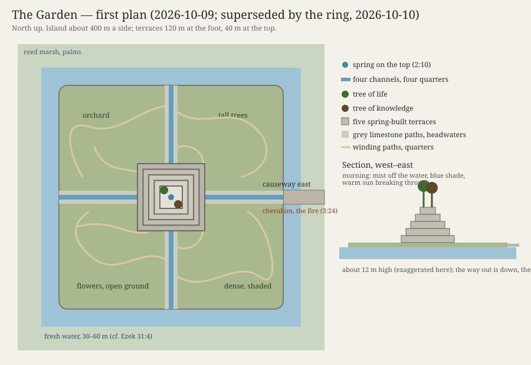

# The Garden — What It Looked Like

> Research for README item 6: the shape, the layout and the light of the Garden of Eden, and what I think of your picture of it. Companion to the [Garden dossier](./DOSSIER.md), whose §2 ("The look") this extends. Nothing here is decided until you say so.

**Status:** v0.1, 2026-10-09. Written from your note of 2026-10-09:

> I was thinking that the Garden should be square shaped with water surrounding all four sides, but this may be wrong. What I do need the scene to feel like is something natural, with blue-lighting peeking through the trees and bushes from the sun that pairs well with grey/dark grey stone (almost like a Greek feel to me). I want you to deeply research the Garden and what it possibly looked like, its layout, etc. and tell me what you think.

---

## 1. The short answer

**Your square with water on four sides isn't wrong. It's the oldest shape paradise has.** The text never gives the Garden a shape, but every later picture of it that the Bible and its neighbours drew is either square, or ringed with water, or both: Ezekiel's cedar in Eden with "its rivers flowing around the place of its planting" (Ezek 31:4); the holy of holies, a cube (1 Kgs 6:20); the New Jerusalem, "foursquare," with the river of life and the tree of life inside it (Rev 21:16; 22:1–2); and the Persian walled garden, the *pairidaeza*, whose name the Greek Bible borrowed for Eden and which gave us the word "paradise."

**And it fits with the stepped centre** you already proposed instead of replacing it. Put the two together and you get one design where every piece comes from a verse:

- A square island of stone and planting, raised a little above the marsh, with fresh water all round it. That's the enclosure the word *gan* implies, without a wall.
- At its centre, broad low terraces, square like the base of every temple-mountain on that plain, with the two trees on the open top "in the midst of the garden" (2:9; 3:3).
- A spring on the top that runs down the four faces in four channels to the four sides: the "one river divided into four heads" (2:10), in miniature, quartering the Garden the way the Persian paradise garden is quartered.
- **One dry way in, a causeway on the east.** When they're sent out, they cross it, and that's where the cherubim and the turning fire stand (3:24). The water makes the text's "way to the tree of life" a single path you can guard.

**The blue light is right, with one change to how it's made:** in nature the blue comes from the shade, not the sun. Morning mist off the water, cool shadow, and warm shafts of sun breaking through it gives you exactly the image you describe, and it gives the Garden a light of its own that the outside never has.

**The grey stone and the Greek feel work if we keep the feel and leave out the forms:** weathered grey limestone, dry-laid, worn and mossy, under plane trees and cypress (both named in Ezekiel's Eden), and no columns, no carving, no cut marble. Greek forms are three thousand years too late for the plain; the Greek *feeling* (old stone, raking light, a grove that is also a sanctuary) is what you're actually after, and it can be had honestly.

**Grade for the whole design: Compatible.** Supported on the water around the planting (Ezek 31:4), the river dividing (Gen 2:10), the trees at the centre (2:9), the mountain (Ezek 28:14), and the way east (3:24). The square is P4 (the sanctuary, Revelation and the ancient gardens) staged as P5 (yours). The details follow.

---

## 2. What the texts say

Everything the Bible says about the Garden's form, gathered in one place. The texts are few, but they're more specific than most people remember.

### Genesis 2–3

| Feature | Text | What it gives the build |
|---|---|---|
| A garden *in* Eden, in the east | "The LORD God planted a garden in Eden, in the east" (2:8) | Eden is the larger region; the garden is a place within it. *Planted*, not built. |
| *Gan*, a garden | 2:8 and throughout | From the root *g-n-n*, "to enclose, to shield." A *gan* is a protected plot: "a garden locked... a spring sealed" (Song 4:12). The word implies an edge, though the text never says what the edge is. |
| Every tree, for sight and for food | "every tree that is pleasant to the sight and good for food" (2:9) | Beauty first, then food. The trees don't have to be the plain's own; this is planted, and planted with everything. |
| Two trees at the centre | "the tree of life in the midst of the garden, and the tree of the knowledge of good and evil" (2:9); "the tree that is in the midst of the garden" (3:3) | A centre, which is the thing a square or a mountain naturally has. |
| One river, then four | "A river went out from Eden to water the garden, and from there it divided and became four heads" (2:10) | The water rises in Eden, waters the garden, and leaves it in four. "Heads" (*ra'shim*) can mean branches or mouths. |
| Gold, bdellium, onyx | "the gold of that land is good; bdellium and onyx stone are there" (2:11–12) | The Garden's wealth is named as stone and resin: the same onyx (*shoham*) that's set on the high priest's shoulders (Exod 28:9). |
| Work and keep | "to work it and keep it" (2:15) | The same pair of verbs (*'avad*, *shamar*) used of the Levites' service in the tabernacle (Num 3:7–8; 8:26). |
| Fig trees | "they sewed fig leaves together" (3:7) | The one tree named besides the two. There is a fig in the Garden, near enough to reach in a moment of shame. |
| Trees to hide among | "hid themselves... among the trees of the garden" (3:8) | It's dense enough to hide in. Not a park. |
| The wind of the day | "walking in the garden in the wind of the day" (3:8) | The evening breeze: the Garden has a time of day, and a sound. |
| The way east, guarded | "at the east of the garden he placed the cherubim and a flaming sword that turned every way, to guard the way to the tree of life" (3:24) | An entrance on the east, and only one "way." Every later sanctuary of Israel faces east too (Exod 27:13; Ezek 43:1–4; 47:1). |

### Ezekiel 28 and 31: Eden remembered

Ezekiel is the only other writer who describes Eden at length, and he describes it twice, as a parable about kings.

- **A mountain** (28:13–16): "You were in Eden, the garden of God... you were on the holy mountain of God; in the midst of the stones of fire you walked." The Garden is on a height, and its top is paved with something that burns or shines.
- **Stones** (28:13): "every precious stone was your covering: sardius, topaz, and diamond, beryl, onyx, and jasper, sapphire, emerald, and carbuncle; and crafted in gold." Nine stones, all of them among the twelve on the high priest's breastpiece (Exod 28:17–20); the Greek translation lists all twelve. The *sappir* here is almost certainly lapis lazuli, the blue stone. *High confidence on the list and the overlap; medium on the exact identities of the stones.*
- **Water all around** (31:4): "The waters nourished it; the deep made it grow tall, making its rivers flow **around** the place of its planting, sending forth its streams to all the trees of the field." The Hebrew *sevivot* means "all around." This is the clearest support in the Bible for your picture: Eden's great tree stands on ground with rivers going round it.
- **Named trees** (31:8–9): "The cedars in the garden of God could not rival it, nor the fir trees equal its boughs; neither were the plane trees like its branches; no tree in the garden of God was its equal in beauty... all the trees of Eden envied it." Cedar, a fir or cypress (*berosh*), and the plane tree (*'armon*). The plane is the shade tree of Greece and of every Near Eastern river; this is where your Greek feel can come from honestly. *The berosh is disputed: cypress, juniper or fir.*

### The sanctuary: the Garden copied

The tabernacle and the temple were built to remember the Garden, and the scholars (§4) have read them backward to see what the Garden was taken to look like.

- **The holy of holies is a perfect cube** (1 Kgs 6:20), lined with gold, with two cherubim over the ark.
- **The temple walls are a garden:** "carved engraved figures of cherubim and palm trees and open flowers" (1 Kgs 6:29), with gourds and pomegranates (1 Kgs 6:18; 7:18–20). The lampstand is a stylized almond tree (Exod 25:31–36).
- **Cherubim guard the way in** on the veil (Exod 26:31), as at the Garden's east (Gen 3:24).
- **God walks** among his people in the sanctuary with the same verb (*mithallek*) as in the Garden (Lev 26:12; 2 Sam 7:6–7; Gen 3:8).

### Ezekiel 47 and Revelation 21–22: Eden restored

The Bible ends where it began, and the end is drawn as the Garden rebuilt.

- **Water from the sanctuary, flowing east** (Ezek 47:1–12): it rises from under the temple's threshold, grows from ankle-deep to a river, and "on both banks... will grow all kinds of trees for food... their fruit will be for food, and their leaves for healing."
- **The city is square** (Rev 21:16): "The city lies foursquare, its length the same as its width... its length and width and height are equal." A cube, like the holy of holies.
- **The river and the tree inside it** (Rev 22:1–2): "the river of the water of life, bright as crystal, flowing from the throne of God... through the middle of the street of the city; also, on either side of the river, the tree of life."
- **Psalm 46:4** has the same picture: "There is a river whose streams make glad the city of God."

**What the texts add up to:** a centre with two trees; water that rises there and leaves in four; a height; precious stone; rivers flowing round the planting; dense trees, among them cedar, cypress, plane and fig; one way in, from the east. The square is Revelation's, not Genesis's, but it's the Bible's own last word on what the Garden becomes.

---

## 3. What the ancient world says

None of this proves what the Garden looked like. It shows what gardens, and paradise, looked like to the people who lived nearest it in time and place.

**Eridu sat on an island.** The city you set the Garden beside ([008, round 2](../../../../discussions/008-adam-eve-and-the-garden.md#round-2--2026-10-08)) was founded on a virgin sand dune, a low natural rise in a depression that floods into a lake every winter and spring, with the marshes on its east and the Gulf near at hand. Its temple was the house of Enki, god of fresh water, called the "House of the Aquifer," the Abzu: the fresh water under the earth, rising. The first shrine was a small mudbrick square; each rebuilding raised it on a higher platform, seventeen or eighteen times, and that sequence is where the ziggurat comes from. So the real place nearest your Garden was a raised square sanctuary on a rise ringed by water, built over a spring. That's very nearly your picture, drawn in mud by people who might have remembered it.

**The Mesopotamian temple-mountain is square.** Every ziggurat has a square or rectangular base with its corners or faces set to the four directions. The Sumerians called their temple-mountains "house of the mountain" and "bond of heaven and earth."

**The Assyrian kings built hills with gardens on them.** A relief from Ashurbanipal's palace at Nineveh (7th century BC, now in the British Museum) shows a wooded hill, watered by channels fed from an aqueduct, with a small shrine on the top. Stephanie Dalley argues that this, Sennacherib's garden at Nineveh, was the real "Hanging Gardens." A planted mountain with water running down it was the Near East's idea of a royal paradise. *Medium confidence on Dalley's identification; the relief itself is certain.*

**The word "paradise" is Persian, and it means an enclosed, quartered garden.** Old Persian (Avestan *pairidaēza*), "walled around." Xenophon brought it into Greek as *paradeisos*, and the Greek translators of Genesis (the Septuagint, 3rd century BC) used it for the garden in Eden; it's the word in Luke 23:43 and Revelation 2:7. The oldest surviving one, Cyrus's garden at Pasargadae (6th century BC), is laid out on axes of stone water-channels; the later Persian *chahar bagh* ("four gardens") is a rectangle quartered by four channels meeting at a central pool, and it was read, in the Islamic period, as the four rivers of paradise. Your square with water is, almost exactly, the thing the word "paradise" first named.

**Gilgamesh walks through a garden of stone** (Tablet IX). Beyond the mountains at the end of the world he comes to trees of gemstones: carnelian bearing fruit, lapis lazuli bearing leaves. It's the same image as Ezekiel's "every precious stone," centuries before him, and its leaves are blue. *Medium confidence on the line-by-line wording, which differs between translations.*

**Dilmun, the Sumerian paradise, is an island** down the Gulf (Bahrain), "where the lion kills not," pure, watered by Enki's fresh water rising from below. The Sumerian paradise is a place ringed by the sea, where fresh water comes up through the salt.

**The Greeks put paradise on water too.** The Garden of the Hesperides, at the western edge of the world beside the river Ocean, has a tree with golden fruit and a serpent coiled round it (Ladon). The Isles of the Blessed and Elysium lie across the water. I suspect this is part of why your picture feels Greek to you: the Greeks remembered paradise as a garden across water, with a tree and a serpent. That's a resonance to be aware of, not a source; the audience may feel it too.

**And the counterfeit is square and moated.** Herodotus describes Babylon (1.178–180): "in shape a square... Around it runs first a moat deep and wide and full of water... It is cut in half by a river," the Euphrates. Whatever his accuracy, that's the classical picture of Babylon: Eden's plan, built in brick by men, with the river through it. Revelation sets Babylon (Rev 17–18) against the New Jerusalem (21–22) on purpose. See §5.6.

---

## 4. What the scholars say

**The Garden is the first sanctuary.** This is close to a consensus in Old Testament scholarship since Gordon Wenham's paper "Sanctuary Symbolism in the Garden of Eden Story" (1986), carried on by G. K. Beale (*The Temple and the Church's Mission*, 2004), John Walton (*Genesis*, NIV Application Commentary, 2001; *The Lost World of Genesis One*, 2009) and others. The evidence is the list in §2: the east entrance, the cherubim, the verbs for the Levites' work, God walking, the gold and onyx, the menorah as a tree, the temple's carved garden. Discussion 009 already rests on it ([009, "What the texts say"](../../../../discussions/009-god-in-the-garden.md)).

**Three zones.** Walton and Beale read the geography as concentric: Eden itself, the source, where God's presence is (like the holy of holies); the garden beside it, where the man serves (like the holy place); and the world outside (like the courtyard, and then the nations). The water flows outward through all three. That's a layout, and it's a nesting of squares in the sanctuary that copies it.

**Eden is on a height.** Besides Ezekiel 28, the river flowing out of Eden to water the garden and leave it implies the source is higher than what it waters. Many readers (Wenham among them) take the "mountain of God" as part of the Garden's picture, joined to Sinai and Zion later.

**The case against all of this.** Some scholars (James Barr among the older ones) caution that Genesis 2–3 is spare on purpose and that reading the temple into it imports a later theology into an older story. Others read the Garden as a royal park, a king's garden in the Near Eastern style, with the man as its gardener-king, not its priest. Both are worth keeping in mind: the first argues for restraint in the build, the second agrees with the formal, quartered shape for a different reason.

---

## 5. Your picture, tested

### 5.1 Square

**For it.** The Bible's own final Garden is square (Rev 21:16) and its holiest room is a cube (1 Kgs 6:20). Ezekiel's restored sanctuary and holy portion are square too (Ezek 45:2; 48:20). The temple-mountains of the Garden's plain are square-based. The paradise garden is quartered. A square has a centre and four directions, and the text has a centre (2:9) and a river that goes four ways (2:10).

**Against it.** Genesis doesn't say. A perfect square looks made by someone, and "the LORD God planted" (2:8). The more geometric it is, the more it reads as a palace garden, and the more the Garden looks like Babylon.

**What I'd do.** Square in its bones, soft at its edges: the island and the terraces are laid out on the four directions, and the four channels quarter it, but the shoreline is stone and roots and reeds, uneven, overgrown. You feel the square from the top of the terraces, looking down, and nowhere else. **Grade: Compatible** (P4 from Revelation and the sanctuary; P5 the staging).

### 5.2 Water on all four sides

**For it.** Ezekiel 31:4 says it in so many words: rivers flowing all around the place of its planting. It makes *gan*, the enclosed garden, an enclosure without a wall, which keeps the dossier's rule (no wall in the text) and fixes its weakness (a *gan* needs an edge). Eridu itself was a rise ringed by water. It turns 3:24 into something you can see: water on every side and one way across it, from the east. And it fits the decided geography: the lower plain in 5000 BC was a land of marsh and channels at the sea's edge, so an island is the most natural thing in it.

**Against it.** Genesis 2:10 has water flowing *out* of the Garden in four, not round it. And Revelation's new world has "no more sea" (Rev 21:1), so water as the Garden's barrier may sit oddly with the sea as chaos.

**What I'd do.** Let the surrounding water be fresh and moving, the four channels running down from the spring and out into it, so it's the river leaving the Garden, not a moat holding it in. Beyond it is the marsh, and beyond the marsh, at the edge of sight, the salt sea. Fresh water inside and around, salt water far off: the line between them is exactly the line the Sumerians drew at Eridu (Enki's fresh Abzu against the salt sea). The fresh water is the Garden's; the sea is the world's. **Grade: Supported** on water around the planting (Ezek 31:4), **Compatible** on four sides.

### 5.3 Blue light through the trees

**For it.** It's beautiful, and it gives the Garden a light the outside doesn't have. Blue has a home in the texts: the pavement "like sapphire, like the very heaven for clearness" under God's feet on the mountain (Exod 24:10), the throne "like sapphire" (Ezek 1:26), Eden's *sappir* (Ezek 28:13), and Gilgamesh's lapis leaves.

**A correction on how to get it.** Direct sunlight through leaves is warm, and the light under a canopy is green. Blue comes from the sky: shadows lit by open sky are blue, and fine mist scatters blue light. So the look you describe is made like this: **cool blue shade, mist, and warm shafts of sun cutting through it.** The mist is in the text: the KJV's "there went up a mist from the earth, and watered the whole face of the ground" (2:6), the *'ed*, which 008 reads as the river's rising water. A morning mist off the water around the Garden, lit through the trees, is the 'ed made visible.

**What I'd do.** The Garden's light is cool, misty, with sunlight breaking in; the evening of 3:8 adds the wind through it. Outside, the light is flat, white and hot (the dossier's first shot after 3:24: "no color at all: mud, dust, thorns, heat"). The blue is in the light, never painted on the stone, so the color rule ("color only in what lives") holds. **Grade: Compatible.** P5.

### 5.4 Grey and dark grey stone

**For it.** The dossier already argues that the Garden's stone is the sign it isn't the plain's own work (the plain has no stone: "they had brick for stone," Gen 11:3). Grey stone under blue light is the right pair: the stone takes the light's color. Ezekiel's "stones of fire" on the mountain can be the summit's pavement catching the sun.

**Against it.** Dark grey can read as heavy or funereal. The text's Garden is about delight (*'eden* in Hebrew sounds like "delight").

**What I'd do.** A grey limestone, weathered, dry-laid (no mortar), worn smooth where feet go, green with moss where water runs. Darker grey at the waterline and in the channels, where it's wet; lighter at the summit, where it's dry and in the sun. Never cut square, never carved: placed. **Grade: Compatible.** P5.

### 5.5 "Almost like a Greek feel"

**For it.** I think what you're after is a mood: old stone in a grove, raking light, a place that is a sanctuary without being a building. That is honest to the text, which makes the Garden a sanctuary and gives it plane trees and cypress (Ezek 31:8).

**Against it.** Greek forms (columns, capitals, pediments, marble, statues) belong to the first millennium BC and to Greece. In the plain in 5000 BC they would be wrong twice over, and they would turn the Garden into the Hesperides.

**What I'd do.** Keep the feel; leave out the forms. Get it from the trees and the stone: plane trees with their pale bark over the water, cypress, cedar, olive, fig, pomegranate, with the plain's own date palm and tamarisk only at the shore. Grey limestone in terraces like the old dry-stone terraces of Greek hillsides. **Grade: Compatible** for the feel; **Contradiction**, of the setting rather than the text, for any Greek architecture.

### 5.6 The shape's double

Herodotus's Babylon is a square with a moat and a river through it. If the Garden is a square island with four channels, then Babel (Hour 7) and Babylon later (the Exile, and Revelation) are humanity's rebuilding of it: brick for stone, a wall for the water, a tower for the trees. The dossier already makes this argument for the stepped centre ([§2, point 3](./DOSSIER.md#2-the-look)); the square and the water make it stronger. It's an opportunity, and a risk: the Garden's design has to be clearly natural and alive, so the rhyme with Babylon reads as Babylon copying Eden and not the other way round.

---

## 6. What I'd build

The proposal, all P6 for you to change. 

### The plan

1. **The island.** Square, about 400 m a side, oriented to the four directions, raised a metre or two above the water. Its edges are stone and roots, never straight for long. Walking from the shore to the centre takes about four minutes; Adam's first silent walk (movement 1) can wander well beyond that.
2. **The water.** Fresh, slow and clear, 30–60 m wide around all four sides, fed by the four channels; beyond it the reed marsh, and beyond that the plain and, on the far south-east horizon, the sea. Reeds and date palms on the outer bank: the plain's own, seen from inside.
3. **The four quarters.** The four channels divide the island into four planted quarters, each different (one of orchard, one of tall trees, one of flowering plants and open ground, one wild and dense). Stone paths run along both sides of each channel, with smaller paths into the quarters. The animals use the paths.
4. **The terraces.** At the centre, five broad, low steps of placed grey stone, about 120 m square at the foot and 40 m at the top, each about two and a half metres high, about 12 m in all. Uneven, worn, overgrown at the edges. A ramp or stair in the middle of each face, beside the channel. (This is the dossier's stepped centre, now squared to match.)
5. **The top.** Open. A pavement of lighter stone that catches the sun (Ezekiel's "stones of fire"). The spring rises in the middle and splits four ways to the four faces. The two trees stand on either side of it, looking different but neither strange (dossier §2). That is Revelation 22:2 too: the tree of life "on either side of the river." From here you can see the whole Garden and the water round it.
6. **The way east.** One causeway across the water on the east side, from the end of the eastern channel's path to the plain. It's the only dry way in or out. It's how they leave, a descent from the top and then the crossing, and the cherubim and the turning fire stand on it (3:24).

### The light and the palette

- **Morning:** mist off the water and the channels, cool blue shade, warm shafts through the trees. The first shot of the Garden.
- **Day:** the blue thins out but stays in the shadows. Grey stone, deep green, and color only in what lives (the dossier's rule): flowers, fruit, birds, fish in the channels, the animals.
- **Evening (3:8):** the wind of the day moving the trees; the light goes long and gold across the terraces; the shadows go deep blue. The sound in the wind is heard in that light.
- **Outside:** flat, white, hot, without mist or shade.

### The plants

From the texts: fig (3:7), cedar, cypress or fir, and plane (Ezek 31:8), palm and pomegranate (the temple's garden, 1 Kgs 6:29; 7:18), almond (the lampstand, Exod 25:33). From your note: bushes and dense undergrowth to break the light. Olive is my addition: the dove brings back its leaf in Genesis 8:11, and a viewer who has seen one in the Garden will notice. The plain's own plants (date palm, tamarisk, reeds) stay at the shore, so the Garden's are all strangers there.

### For the build

All of this is buildable in Blender: a terrain mesh, scattered vegetation (geometry nodes or a scatter add-on), volumetric mist with a sun lamp for the shafts, and a sky texture for the blue fill. In live action it's a terraced water garden, a set or a location in the Mediterranean or Iran with digital extension.

---

## 7. The case against

- **Too designed.** The more square and symmetrical it is, the more it reads as human work, against "planted." Answer: soften it everywhere except from above.
- **Too much meaning.** Every element here has a verse behind it, but the audience shouldn't feel a diagram. The Garden must work first as a place someone would want to be.
- **Anachronism.** The Persian garden, Ezekiel, Revelation and the Greek resonance all come thousands of years after the setting. The answer, under this project's own reading, is that the Garden is the original and the later sanctuaries and gardens are its copies (Heb 8:5 says the tabernacle was "a copy and shadow" of the heavenly one). But that is a framing, P5, and the design has to look like a garden first.
- **Water and the sea.** Revelation's new world has no sea. Keep the surrounding water fresh and moving, and the sea only on the horizon.

## 8. What I need from you

**Do you want the square island with the stepped centre and the causeway east, as in §6?** Yes, no, or change it. If yes, I'll fold it into the dossier's §2 as the Garden's look, and the treatment will use it.
